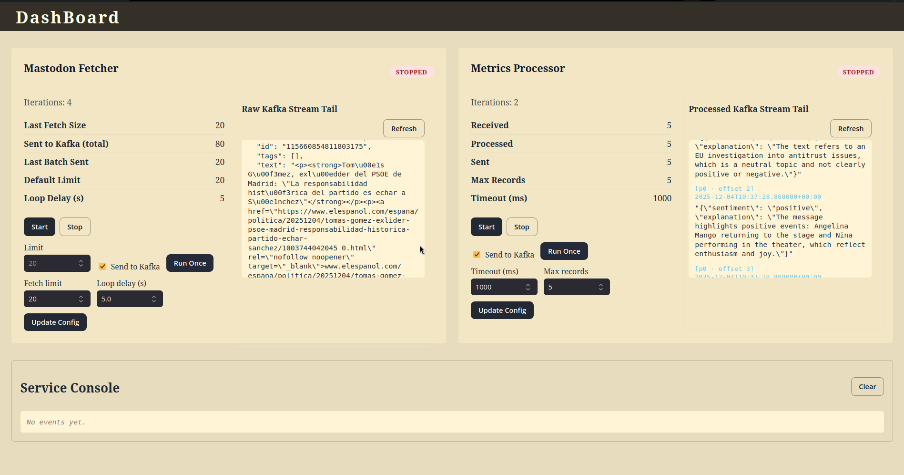

# Mastodon Processor Agent - MLOPS Project (WIP)

[](https://opensource.org/licenses/Apache-2.0)
[](https://www.python.org/)

This repository is a simple MLOPS project that demonstrates the integration of a Mastodon processor agent with Kafka for data streaming and processing.

<div align="center">
  
</div>

## Project Overview

The point is to learn building scalable architectures using:
- ✅ Docker (with proper isolation and shared resources)
- ✅ Docker Compose (for local development)
    - ✅ Mounted secrets (not the most secure)
    - advantage: easy to setup + mounted volumes for code changes
- ✅ K8s/Helm (for production-like deployments)
    - ❌ TODO: Vault or K8s secrets
    - advantage: scalable + closer to production environments
- ❌ TODO: Terraform (local AWS simulation with LocalStack)
- ✅ LLM server for LangChain/LangGraph agents
    - ✅ Ollama (qwen3:0.6b)
    - ❌ TODO: vLLM
- ✅ Kafka for data streaming
    - ❌ TODO: Protobuf serialization
- Dashboard
    - ✅ Controller + Visualizer for the Mastodon agent
    - ✅ Django Mono (backend + frontend)
    - Next.js + Tailwind (frontend) ❌ TODO: migrate to this

The word agent here refers to a stateless (no internal memory) automated event-based system. Perhaps, a more appropriate name would be "Mastodon Listener".

The Mastodon agent listens to new posts on a Mastodon instance, processes them using a language model, and streams the results to Kafka for further analysis or storage.

## 🚀 Setup Instructions

### Quick Start (Using Docker Compose)

1. Install docker (cli)
2. 🎛️ Configure your secrets in `/infra/secrets` file.
3. 🎛️ Configure your llm server in `/infra/llm-server.env` file.
4. Start the services:

```bash
cd infra/docker-compose
docker compose up -d --build
```

5. Open the front http://localhost:58005 to access the application.

### Quick Start (Using Kubernetes)

1. Install docker (cli), kind, kubectl, make
2. 🎛️ Configure the secrets (not done yet)
3. 🎛️ Configure your llm server in `/infra/llm-server.env` file.
4. Create the kind cluster, build and load images, deploy the application:

```bash
cd infra/k8s
make create-cluster

make build # build the images (if not done yet)
make kind-load # load the images into the kind cluster

make deploy # deploy the application
make port-forward # to open localhost:58005
```

5. Open the front http://localhost:58005 to access the application.

## Project Structure

Microservices:
- [`mastodon-fetcher/`](mastodon-fetcher/README.md): Service that fetches posts from a Mastodon instance.
-  [`metrics-processor/`](metrics-processor/README.md): Service that processes fetched posts using a language model.
- [`dashboard/`](dashboard/README.md): Django-based dashboard for visualizing and controlling the Mastodon agent.
- [`llm-server/`](llm-server/README.md): Local LLM server setup using Ollama or vLLM.

Infrastructure as a code:
- `infra/`: Infrastructure configurations for Docker Compose and Kubernetes.
    - `docker-compose/: Docker Compose setup for local development.
    - [`k8s/`](infra/k8s/README.md): Kubernetes manifests and Helm charts for production-like deployments.
- [`localstack/`](localstack/README.md): local AWS simulation using LocalStack (planned).
- [`terraform/`](terraform/README.md): Infrastructure as Code (IaC) configurations using Terraform (planned).

Other:
- `documentation/`: Project documentation and resources.

